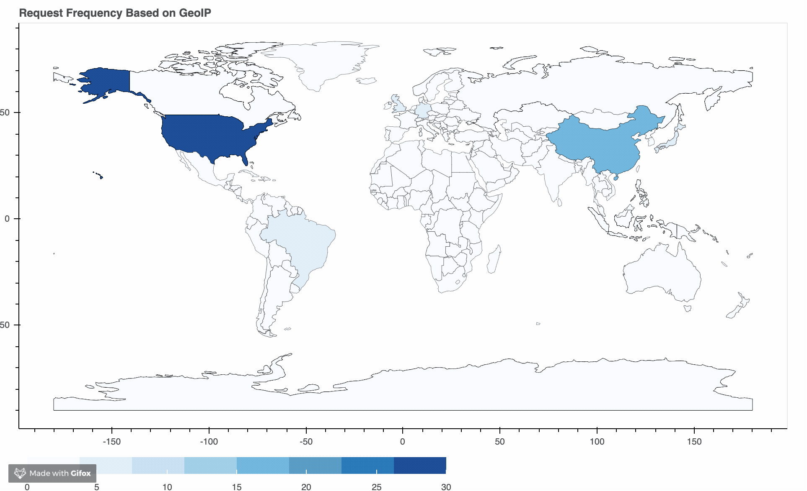

# Dynamic IP Geolocation Map

## Overview
**Under Development**  
This is a simple utility that accepts a list of n+1 IPv4 addresses, queries them against IP geolocation database, and generates a dynamic heatmap showing volume by country of origin. I've found this useful when working with large datasets of IP addresses (such as those generated by WAF, IDS, etc.) to quickly visualize threat volume by country.  

## Usage Instructions
Coming soon  

## Example Heatmap

